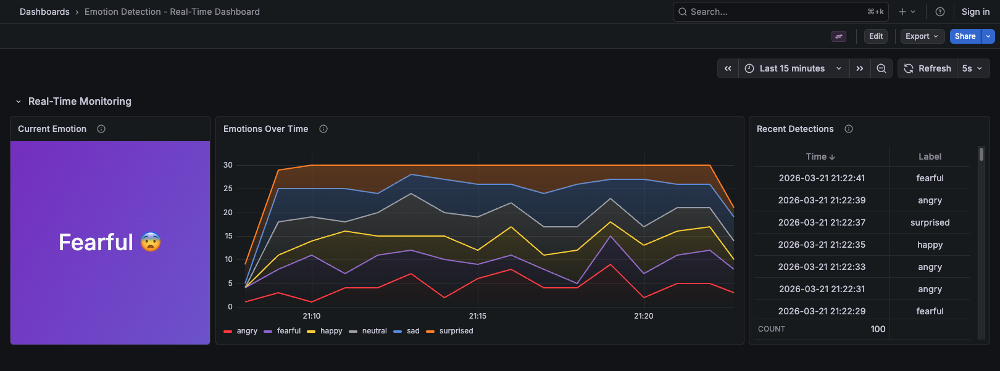

# Emotion Detection with IoT Pipeline

[](https://www.python.org/)
[](LICENSE)
[](#)

Real-time facial emotion detection using your **laptop webcam** and a TFLite CNN model. Detected emotions flow through a full IoT pipeline — MQTT to Node-Red to InfluxDB — and are visualized in a live Grafana dashboard.

> **v3** replaces the OpenMV Cam H7+ hardware requirement with webcam-based detection. Clone, train the model (or bring your own), `make run`, and see emotions flowing through the pipeline. The [legacy OpenMV firmware](firmware/) is still available for hardware users.

<p align="center">
  
</p>

## Architecture

<p align="center">
  
</p>

## Key Results

| Metric | Value |
|--------|-------|
| Classes | Happy, Sad, Angry, Neutral, Surprised, Fearful |
| Input | 48x48 grayscale face images |
| Dataset | FER2013 (~30,000 images) |
| Model | Small CNN exported as TFLite (see [`models/`](models/)) |
| Inference | Real-time on CPU via laptop webcam |

## Project Structure

```
├── src/
│   └── detector.py             # Webcam capture + face detection + emotion classification + MQTT
├── models/
│   ├── emotion_model.tflite    # Pre-trained TFLite model
│   ├── labels.txt              # Emotion labels in model output order
│   ├── train.py                # Training script (FER2013 → TFLite)
│   └── README.md               # Model documentation + how to swap
├── firmware/                   # Legacy OpenMV Cam H7+ code (v1/v2)
│   ├── main.py
│   └── README.md
├── host/
│   └── mqtt_publisher.py       # UART-to-MQTT bridge (for OpenMV hardware users)
├── pipeline/                   # IoT infrastructure (Mosquitto, Node-Red, InfluxDB, Grafana)
│   └── node-red-flows.json
├── notebooks/
│   └── dataset_analysis.ipynb
├── images/                     # Diagrams, screenshots, demo GIF
├── report/                     # Project report (PDF)
├── docker-compose.yml          # One-command IoT pipeline setup
├── Makefile                    # Development commands
├── .env.example                # MQTT configuration template
├── pyproject.toml              # Dependencies (managed by uv)
└── uv.lock                    # Locked dependency versions
```

## Quick Start

### 1. Setup

```bash
git clone https://github.com/EnricoZanetti/Embedded-EmotionNN.git
cd Embedded-EmotionNN
make setup
cp .env.example .env   # edit if needed
```

### 2. Train the Model (one-time)

Download [FER2013](https://www.kaggle.com/datasets/deadskull7/fer2013) (`fer2013.csv`) into the `models/` directory, then:

```bash
uv run python models/train.py
```

This exports `models/emotion_model.tflite`. See [`models/README.md`](models/README.md) for details and how to swap in your own model.

### 3. Try the Demo (No Webcam Needed)

```bash
make pipeline-up    # start Mosquitto, Node-Red, InfluxDB, Grafana
make demo           # publish random emotions every 2s
```

### 4. Run with Webcam

```bash
make pipeline-up
make run            # opens webcam, detects faces, classifies + publishes emotions
```

| Command | Description |
|---------|-------------|
| `make run` | Webcam + MQTT + display window |
| `make run-headless` | Webcam + MQTT, no display (e.g. for SSH) |
| `make demo` | Random emotions to MQTT (no webcam) |
| `make demo-local` | Random emotions to stdout only |

### Pipeline Dashboards

| Service | URL | Description |
|---------|-----|-------------|
| **Grafana** | [localhost:3000](http://localhost:3000) | Emotion detection dashboard (no login required) |
| **Node-Red** | [localhost:1880](http://localhost:1880) | Flow editor — inspect MQTT → InfluxDB pipeline |
| **InfluxDB** | [localhost:8086](http://localhost:8086) | Time-series database UI (login: `admin` / `adminpassword`) |
| **Mosquitto** | `localhost:1883` | MQTT broker (use an MQTT client to inspect) |

<p align="center">
  
</p>

## Legacy Hardware Setup (OpenMV Cam H7+)

<details>
<summary>Click to expand</summary>

The v1/v2 architecture used an OpenMV Cam H7+ for on-device inference, sending emotions over UART to a host PC running `host/mqtt_publisher.py`.

#### Requirements

- OpenMV Cam H7 Plus + [OpenMV IDE](https://openmv.io/pages/download)
- Python 3.12+, [uv](https://docs.astral.sh/uv/), Docker & Docker Compose

#### Steps

1. Train a model via [Edge Impulse](https://www.edgeimpulse.com/) and export as `trained.tflite` + `labels.txt`
2. Flash the camera — see [firmware/README.md](firmware/README.md)
3. `make pipeline-up`
4. `python host/mqtt_publisher.py`
5. View dashboard at [localhost:3000](http://localhost:3000)

</details>

## Dataset

The [FER2013](https://www.kaggle.com/datasets/ananthu017/emotion-detection-fer/data) dataset contains ~35,000 grayscale 48x48 facial expression images. The Disgust class was discarded due to insufficient samples, leaving 6 classes balanced to ~30,000 images.

Explore the dataset distribution in [`notebooks/dataset_analysis.ipynb`](notebooks/dataset_analysis.ipynb).

## Challenges and Limitations

- **Model accuracy** — FER2013 is small and noisy; accuracy is limited compared to larger datasets
- **Lighting & angle** — webcam detection is sensitive to lighting conditions and face angle
- **Single face focus** — publishes the first detected face's emotion per interval

## Future Improvements

- Train with larger/cleaner datasets for higher accuracy
- Add TLS encryption for secure MQTT communication
- Integrate additional sensors (e.g., heart rate) for multimodal emotion analysis
- Explore real-time model fine-tuning based on user feedback

## License

This project is licensed under the MIT License. See [LICENSE](LICENSE) for details.

## References

- [FER2013 Dataset](https://www.kaggle.com/datasets/ananthu017/emotion-detection-fer/data) — Kaggle
- [OpenCV Haar Cascades](https://docs.opencv.org/4.x/db/d28/tutorial_cascade_classifier.html) — Face detection
- [TensorFlow Lite](https://www.tensorflow.org/lite) — On-device ML inference
- [Eclipse Mosquitto](https://mosquitto.org/) — MQTT broker
- [Node-Red](https://nodered.org/) — Flow-based IoT programming
- [InfluxDB](https://www.influxdata.com/) — Time-series database
- [Grafana](https://grafana.com/) — Data visualization
