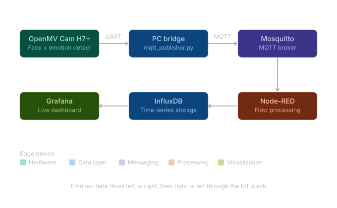

# Emotion Detection on Embedded Systems

[](https://www.python.org/)
[](LICENSE)
[](https://openmv.io/products/openmv-cam-h7-plus)
[](#)

Real-time facial emotion detection running on the **OpenMV Cam H7 Plus**, a resource-constrained edge device. Detected emotions flow through a full IoT pipeline - UART to MQTT to InfluxDB - and are visualized in a live Grafana dashboard.

<p align="center">
  
</p>

## Architecture

<p align="center">
  
</p>

## Key Results

| Metric | Value |
|--------|-------|
| Accuracy | 51.0% (6-class emotion classification) |
| Inference | Real-time on OpenMV Cam H7+ |
| Classes | Happy, Sad, Angry, Neutral, Surprised, Fearful |
| Dataset | FER2013 (~30,000 grayscale 48x48 images) |

<p align="center">
  
</p>

> **Note:** This is **the second version (v2)** of the project - a major refactor with a fully containerized IoT pipeline, demo mode, and improved code quality. The [project report](report/IoT_Project_Report.pdf) documents the original version (v1), covering the initial research, model training methodology, and hardware experiments.

## Project Structure

```
├── firmware/               # MicroPython code running on the OpenMV Cam
│   ├── main.py             # Face detection + emotion classification + UART output
│   └── README.md           # Flashing instructions
├── host/                   # Python code running on a connected PC
│   └── mqtt_publisher.py   # UART-to-MQTT bridge with demo mode
├── pipeline/               # IoT infrastructure configuration
│   └── node-red-flows.json # Node-Red flow: MQTT → InfluxDB
├── notebooks/              # Data analysis
│   └── dataset_analysis.ipynb
├── images/                 # Diagrams, screenshots, demo GIF
├── report/                 # Project report (PDF)
├── docker-compose.yml      # One-command IoT pipeline setup
├── Makefile                # Common development commands
├── .env.example            # MQTT configuration template
├── pyproject.toml          # Project metadata and dependencies (managed by uv)
└── uv.lock                 # Locked dependency versions
```

## Quick Start

### Try the Demo (No Hardware Needed)

Spin up the full IoT pipeline locally and feed it synthetic emotion data:

```bash
# 1. Start the pipeline (Mosquitto, Node-Red, InfluxDB, Grafana)
make pipeline-up

# 2. Run the publisher in demo mode
cp .env.example .env    # edit .env if needed
make demo
```

This publishes random emotions every 2 seconds. Monitor the full pipeline through these dashboards:

| Service | URL | Description |
|---------|-----|-------------|
| **Grafana** | [localhost:3000](http://localhost:3000) | Emotion detection dashboard (no login required) |
| **Node-Red** | [localhost:1880](http://localhost:1880) | Flow editor - inspect MQTT → InfluxDB pipeline |
| **InfluxDB** | [localhost:8086](http://localhost:8086) | Time-series database UI (login: `admin` / `adminpassword`) |
| **Mosquitto** | `localhost:1883` | MQTT broker (no UI - use an MQTT client to inspect) |

### Full Hardware Setup

#### Requirements

- OpenMV Cam H7 Plus + [OpenMV IDE](https://openmv.io/pages/download)
- Python 3.12+
- [uv](https://docs.astral.sh/uv/) (Python package manager)
- Docker & Docker Compose (for the IoT pipeline)

#### Steps

1. **Clone and install dependencies:**
   ```bash
   git clone https://github.com/EnricoZanetti/Embedded-EmotionNN.git
   cd Embedded-EmotionNN
   make setup
   ```

2. **Train and deploy the model:**
   - Create an [Edge Impulse](https://www.edgeimpulse.com/) project
   - Upload the [FER2013 dataset](https://www.kaggle.com/datasets/ananthu017/emotion-detection-fer/data) (~30,000 images, balanced across 6 classes)
   - Design an impulse with image processing + transfer learning blocks
   - Use the EON Tuner to select an optimal model for the H7+
   - Export the trained model as `trained.tflite` with a `labels.txt`

3. **Flash the camera** - see [firmware/README.md](firmware/README.md)

4. **Start the IoT pipeline:**
   ```bash
   make pipeline-up
   ```
   Then import `pipeline/node-red-flows.json` into Node-Red at [localhost:1880](http://localhost:1880).

5. **Run the MQTT publisher:**
   ```bash
   cp .env.example .env   # configure your MQTT settings
   python host/mqtt_publisher.py
   ```

6. **View the dashboard** at [localhost:3000](http://localhost:3000) (Grafana, default login: admin/admin).

<p align="center">
  
</p>

## Dataset

The [FER2013](https://www.kaggle.com/datasets/ananthu017/emotion-detection-fer/data) dataset contains ~35,000 grayscale facial expression images categorized into 7 emotions. The Disgust class was discarded due to insufficient samples, leaving 6 classes. The dataset was further reduced to ~30,000 images due to Edge Impulse free-tier limits, keeping classes balanced.

Explore the dataset distribution in [`notebooks/dataset_analysis.ipynb`](notebooks/dataset_analysis.ipynb).

## Challenges and Limitations

- **Model accuracy** - 51% is limited by short training epochs (Edge Impulse free-tier constraint) and the small, noisy FER2013 dataset
- **Wired communication** - UART requires a physical USB connection; a WiFi shield with UDP would enable wireless operation
- **No real-time user feedback** - the system detects emotions but doesn't provide feedback to the subject

## Future Improvements

- Train with larger/cleaner datasets and longer epochs for higher accuracy
- Add a WiFi shield for wireless communication (UDP or MQTT directly from the camera)
- Build a user-facing interface for real-time emotion feedback
- Add TLS encryption for secure MQTT communication
- Integrate additional sensors (e.g., heart rate) for multimodal emotion analysis
- Explore more powerful edge platforms (e.g., Jetson Nano) for larger models

## License

This project is licensed under the MIT License. See [LICENSE](LICENSE) for details.

## References

- [FER2013 Dataset](https://www.kaggle.com/datasets/ananthu017/emotion-detection-fer/data) - Kaggle
- [OpenMV Cam H7 Plus](https://openmv.io/products/openmv-cam-h7-plus) - OpenMV
- [Edge Impulse](https://www.edgeimpulse.com/) - ML model training platform
- [Eclipse Mosquitto](https://mosquitto.org/) - MQTT broker
- [Node-Red](https://nodered.org/) - Flow-based IoT programming
- [InfluxDB](https://www.influxdata.com/) - Time-series database
- [Grafana](https://grafana.com/) - Data visualization
